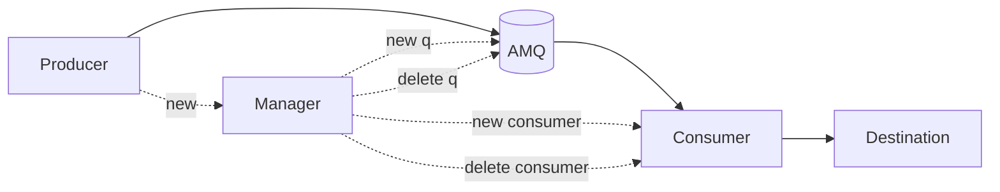
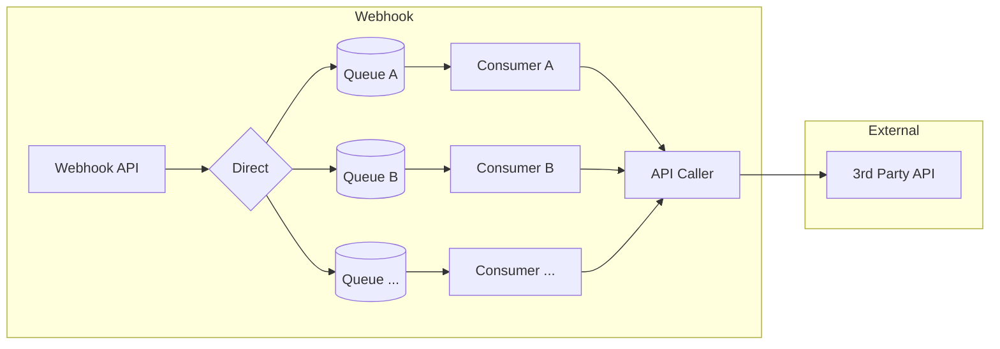
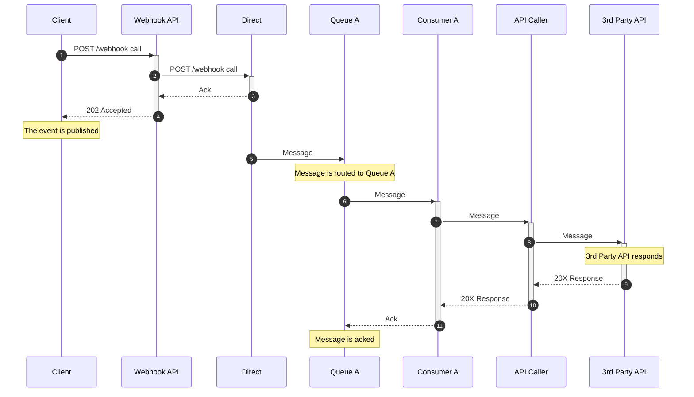
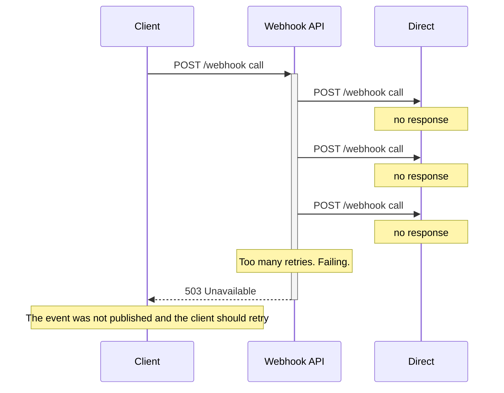
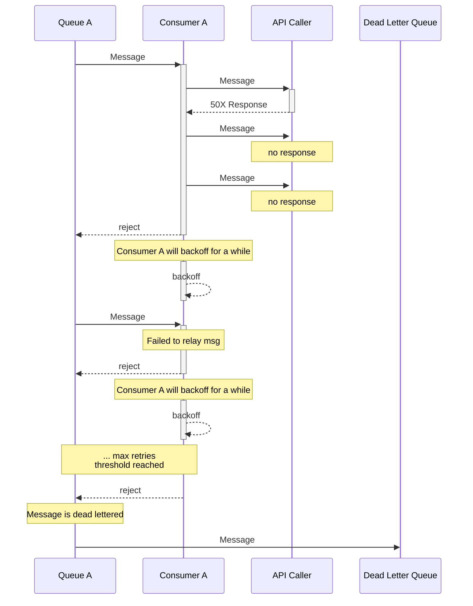
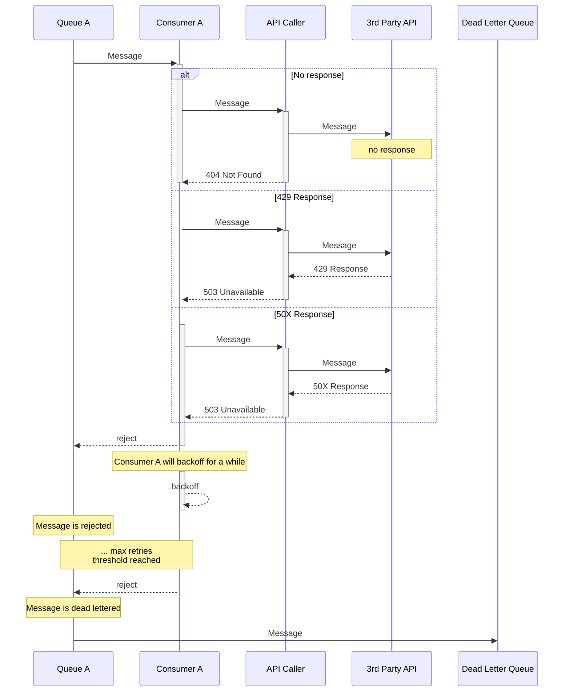
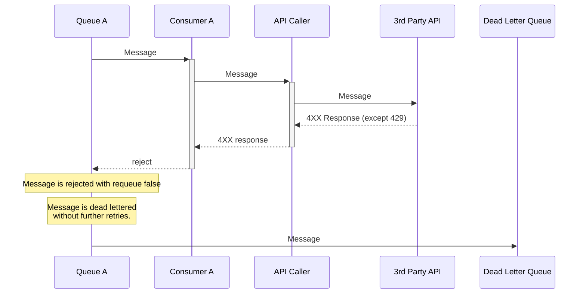

# The challanges
Have support for async and sync calls.
Allow to scale.

Plugin observability and alarms.

Destination may be available or not. So, we need to implement a backoff and retry mechanism. But this shouldn't affect the rest of the destinations. So, we need to implement a backoff and retry per destination.

Having a centralized solution requires flexibility to support different contracts. One call may translate to URI with a query string, another may translate to a URI with a path, another may to a payload and any combination of the previous should be possible.

# Based in AMQ
The idea is to use AMQ as the broker. This will allow to have a centralized solution and to scale horizontally. Also, it will provide a native async support.  

To reduce the AMQ footprint, we will be using short lived queues (determined by configuration).  

Also, because of the reasons already explained, we will be using a queue per destination. This implies having a consumer per destination also.  

The consumer will be responsible for translating the message to the destination contract and to send it to the destination. The producer API will be responsible for setting the contract that will allow such translation.  

The producer will not only be responsible for sending the message to the queue, but it will create the a new queue for a new destination and trigger the process to set a new listener.  

The consumer will be responsible for setting the listener and to start consuming messages.  

There will be a manager that will be responsible for managing the lifespan of the queues and the consumers.

The system will follow the at least once delivery pattern.

# The solution
## Big blocks

## AMQ detail

## Happy flow
If everything goes well, the producer will send the message to the AMQ server and the consumer will receive it and send it to the destination. The destination will respond and the consumer will ack the message. The producer will ack the call.

## Fail to send to AMQ
If the AMQ server doesn't respond, the producer will retry to send the message to the AMQ server. If the AMQ server doesn't respond after a number of retries, the producer will fail the call. The client should retry the call.

## Fail to send to destination
If the consumer fails to relay the message to the destination, the consumer will retry to send the message to the destination. If the destination doesn't respond after a number of retries, the consumer will fail the call and reject the message to the AMQ. The AMQ will keep sending the message to the consumer until the consumer succeds or until the threshold of the number of allowed delivery retries is reached. If the threshold is reached, the AMQ will send the message to the dead letter queue.

### Consumer fails to relay the message to the API Caller

### API Caller fails to relay the message to the 3rd Party API
If the API Caller fails to relay the message to the 3rd Party API, the consumer will reject the message and the AMQ will continue to deliver the message until the threshold of the number of allowed delivery retries is reached. If the threshold is reached, the AMQ will send the message to the dead letter queue. This behaviour is valid for situations when repeating the call to the 3rd Party API may solve the problem.

### API Caller receives a 40X response
Receving a 4XX response from the 3rd Party API means that the message is not valid. The consumer will permanently reject the message and the message will be dead lettered.  

